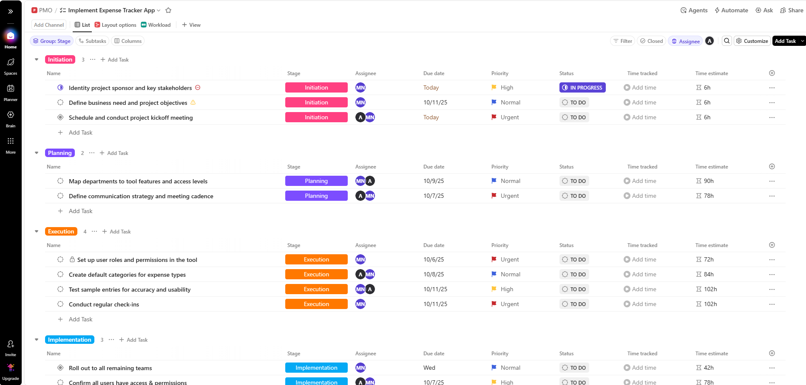
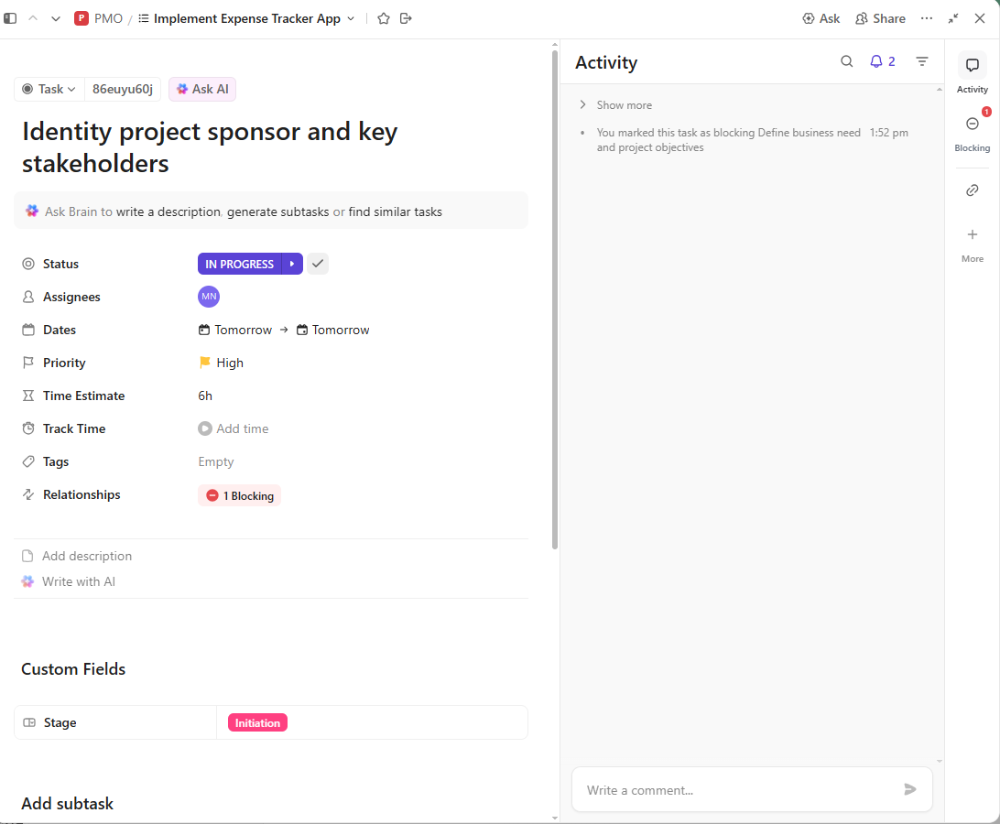
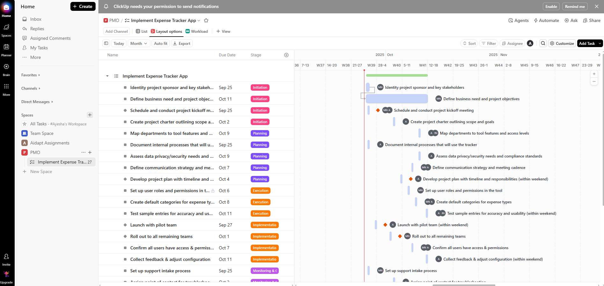
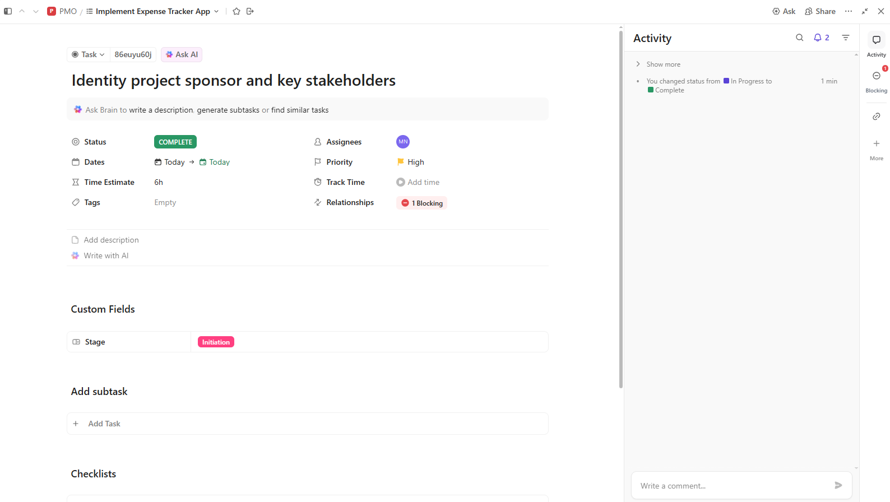
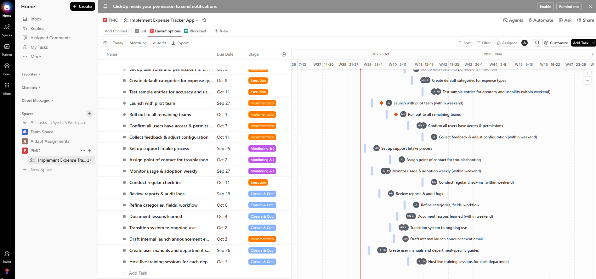
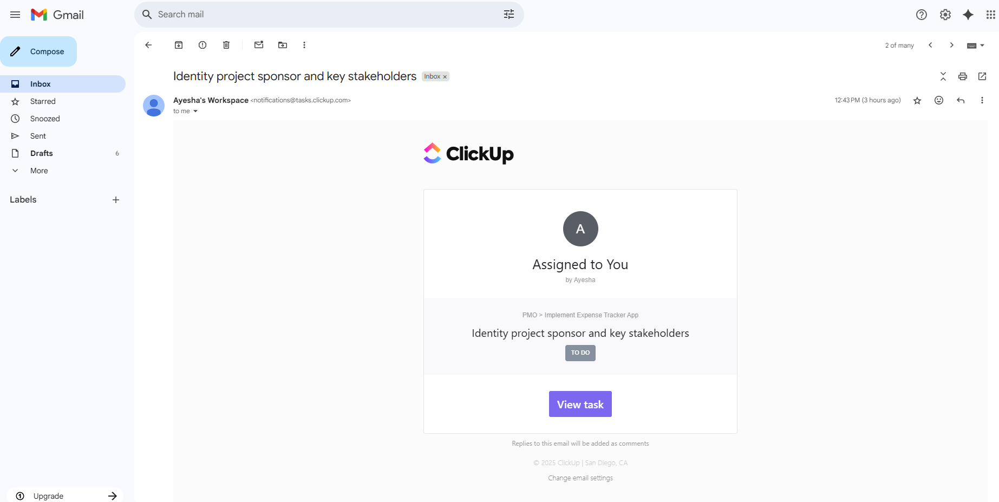
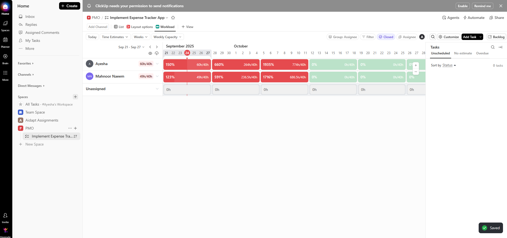

# 🚀 Project Plan in ClickUp – Expense Tracker App

This guide shows how to create and manage a **Project Plan in ClickUp** using the *Expense Tracker App*, with real screenshots from your workspace.

---

## 1️⃣ Project Setup & Task Creation
- Create a Space/Project for the **Expense Tracker App**.
- Add tasks under stages: **Initiation**, **Planning**, **Execution**, **Implementation**, **Monitoring & Control**, **Closure & Optimization**.
- For each task, set **Assignee**, **Due Date**, **Priority**, **Status**.

---

## 2️⃣ Task Priorities, Status & Time Estimates
- Use **Priority** (Urgent/High/Normal), **Status** (TO DO / In Progress / Done).
- Track **Time estimate** vs **Time tracked** to manage capacity.

---

## 3️⃣ Assigning & Scheduling Tasks
- Assign tasks to owners.
- Due dates feed into workload calculations.
- Example: “Identify project sponsor” with a **6h** time estimate.

---

### ✅ Task Completion Update

- **Task:** Identity project sponsor and key stakeholders  
- **Status:** ✅ Completed  
- **Due Date:** Today  
- **Completion Date:** Today  
- **Result:** Task was completed on time as planned.

---

## 4️⃣ Implementation Stage
- Typical tasks:
  - **Launch with pilot team**
  - **Roll out to remaining teams**
  - **Confirm access & permissions**
  - **Collect feedback & adjust configuration**

---

## 5️⃣ Monitoring & Control
- Add tasks to keep adoption on track:
  - **Set up support intake process**
  - **Assign troubleshooting POC**
  - **Monitor usage & adoption weekly**

---

## 6️⃣ Closure & Optimization
- Finalize and hand off:
  - **Review reports & audit logs**
  - **Document lessons learned**
  - **Transition to ongoing use (BAU)**

---

## 7️⃣ Gantt Chart View
- Switch to **Gantt** to visualize **timelines & dependencies**.
- Spot overlaps, adjust durations, meet deadlines.

---

## 8️⃣ Workload View
- See **capacity vs assigned hours** by assignee.
- Green = within capacity, Red = overloaded; rebalance as needed.

---

## 9️⃣ Email Notifications
- Assignees receive **email notifications** on new tasks & changes.
- Keeps everyone accountable and in the loop.

---

## 🔟 Weekly/Daily Capacity Planning
- Use weekly capacity view to manage load.
- Overloads show with percentages (helpful for reassigning work).

---

## ✅ Tips
- Keep **README.md** and **screenshots/** in the **same folder level**.
- Filenames in the Markdown must **exactly match** the images in `screenshots/`.
- If an image doesn’t render on GitHub, confirm the file exists and is committed.
